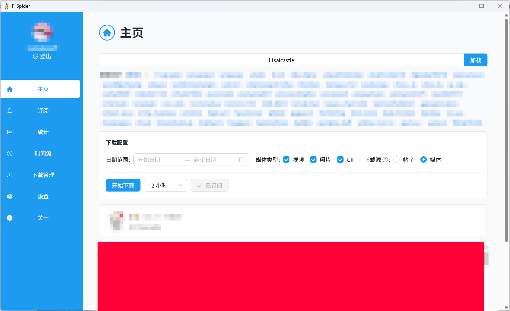

# P-Spider

多平台内容下载器：**X（推特）** 媒体下载 + **Pawchive** 归档站（Patreon / Fanbox / Discord）检索、订阅与批量下载，支持统计、时间流。

> **本项目为 [X-Spider](https://github.com/MiningCattiva/x-spider) 的修改版（fork）**，在原版基础上新增订阅、统计、时间流、Pawchive 平台等功能。原版版权归其原作者所有，本项目遵循 GPL-3.0 许可证。

## 功能特性

### X（推特）

- 主页检索用户，按日期范围 / 媒体类型过滤下载图片、视频、GIF
- 可配置文件名、保存路径格式（模板）
- 跳过已下载文件、手动 / 自动代理、Cookie 登录

### Pawchive

- **多源检索**：输入创作者数字 ID 或链接（`https://pawchive.pw/fanbox/user/3316400`）检索创作者
- **帖子网格**：按帖子展示封面与附件数，支持单帖整包下载、批量下载全部
- **目录结构**：`保存目录/创作者名/帖子标题/`，附件保留原始文件名
- **外链处理**：帖子内含网盘外链时，标题文件夹加 `[needDL]` 标记并生成 `链接清单.txt`
- **仅预览附件**：原图未归档的附件自动降级下载缩略图
- **订阅**：Pawchive 创作者订阅，自动追更新帖

### 通用

- **订阅自动追更**：账号/创作者订阅，设置刷新间隔自动检查并下载新内容，支持一键刷新、导出/导入订阅
- **统计**：按日期查看订阅新增下载量柱状图与排行
- **时间流**：近 7 天下载记录按时间倒序浏览，缩略图 + 原图预览
- **下载管理**：实时下载速度、进度、暂停/重试/重新下载
- **开机自启动**、**关闭最小化到托盘**、**下载历史记录**

## 下载

[Releases](https://github.com/mdo730/P-spider/releases/latest)

> 绿色版：`P-Spider.exe` 需与 `aria2c.exe` 放在同一目录。

## 软件截图

## 致谢

本项目基于 [X-Spider](https://github.com/MiningCattiva/x-spider) 修改开发（fork）。

- **原版仓库**：[MiningCattiva/x-spider](https://github.com/MiningCattiva/x-spider)
- **原版作者**：[MiningCattiva](https://github.com/MiningCattiva)
- **开源协议**：GPL-3.0（与 X-Spider 一致），保留原 LICENSE