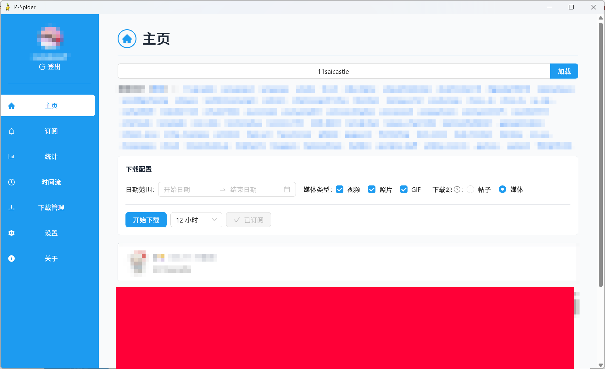
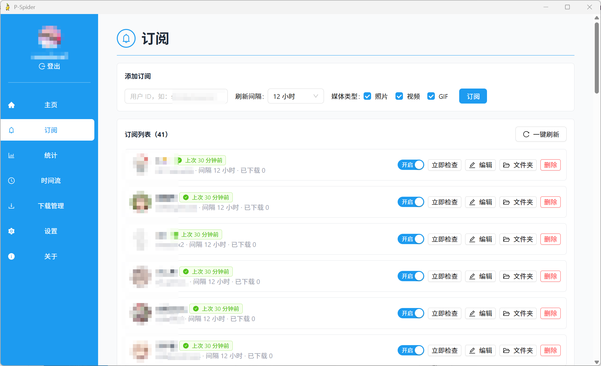
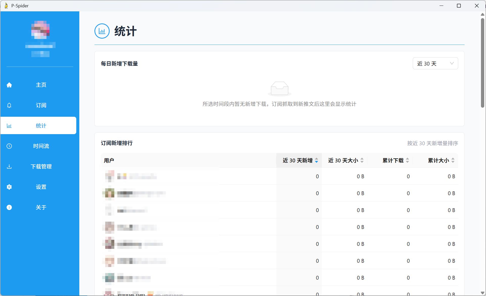
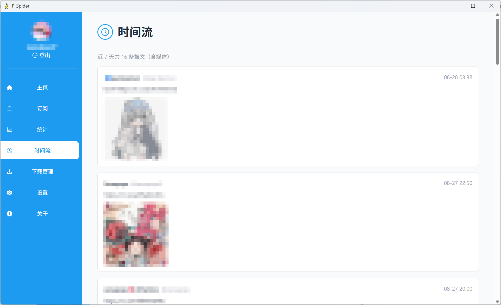

# P-Spider

多平台内容下载器：**X（推特）**媒体下载 + **Pawchive** 归档站（Patreon / Fanbox / Discord）+ **pixiv** 插画下载与订阅，以及 **fig-memo / moeyo 手办资讯**订阅与本地标签管理；支持统计、时间流、本地库。

> **本项目为 [X-Spider](https://github.com/MiningCattiva/x-spider) 的修改版（fork）**，在原版基础上新增订阅、统计、时间流、Pawchive / pixiv 平台、本地库、fig-memo / moeyo 等功能。原版版权归其原作者所有，本项目遵循 GPL-3.0 许可证。

## 功能特性

### X（推特）
- 主页检索用户，支持输入**用户名 / @用户名 / 主页链接 / 推文链接**
- 按日期范围 / 媒体类型过滤下载图片、视频、GIF
- 可配置文件名、保存路径格式（模板）；跳过已下载文件
- 手动 / 自动代理、Cookie 登录

### Pawchive
- **多源检索**：输入创作者数字 ID 或链接检索创作者
- **帖子网格**：按帖子展示封面与附件数，支持单帖整包下载、批量下载全部
- **目录结构**：`保存目录/创作者名/帖子标题/`，附件保留原始文件名
- **外链处理**：帖子内含网盘外链时，标题文件夹加 `[needDL]` 标记并生成 `链接清单.txt`
- **仅预览附件**：原图未归档的附件自动降级下载缩略图
- **订阅**：Pawchive 创作者订阅，自动追更新帖

### pixiv
- **浏览器登录**：设置 →「平台」→ pixiv，点「打开 pixiv 登录页」在浏览器登录即可（授权码回跳，一般自动完成）；只保存凭据
- **浏览 / 下载**：输入画师主页 / 作品链接 / 数字 ID；支持**作品类型 + 时间范围**筛选；多图全下
- **ugoira 动图**：默认存 mp4；勾选「GIF 转真 gif」时存 gif
- **订阅追新**：画师页「订阅该画师」，定时检查新作品并自动下载，结果进时间流
- **R18**：需 pixiv 账号开启「R-18 表示」

### fig-memo（手办资讯，自用功能）
- **全站文章列表**：拉取 fig-memo 站点全站文章（**含未下载**），与本地已下载状态合并；封面本地优先，卡片显示图片数
- **标签树（自动 + 手动）**：**分类 / 厂商 / 年份** 由站点数据自动生成；**文章级标签**（姿势 / 发型 / 体型…）手动标注，支持搜索、多选、输入新建自定义值与新建分类
- **筛选**：标签（含子孙，多标签可选 **交集 / 并集**）+ **未打标签**（忽略自动三类）+ **收藏**，均可叠加
- **快速打标**：详情右下角**快捷标签墙**（点一下即打/取消）、心形**收藏**；卡片缩略图右下角显示 **已下载 / 已收藏 / 已打标签** 小角标
- **浏览**：详情图片网格（本地优先）、正文；**上一篇 / 下一篇**按当前筛选列表跳转、**空格键**下一篇；「保存该文章」一键加入下载
- **Hpoi 联动**：详情页悬浮 **Hpoi 候选匹配**，支持「重新检索 / 手动校正（贴链接）」；展示 Hpoi 评分与标签，列表支持**按评分排序**
- **订阅追新**：每个站点分类一个开关，开启后每 **24h** 检查并下载新文章（不回补历史）；另有「建库」下载现存全部
- **数据内置**：站点清单、图片数、Hpoi 绑定随包附带（不含个人手标标签），新用户首启即可用

### moeyo（手办资讯）
- **全站文章列表**：拉取 moeyo 站点文章（**含未下载**），与本地已下载状态合并；封面本地优先
- **分类 / 年份标签树**：由站点数据自动生成（分类整备为少数几类，其余自动归并；事件类独占）
- **列表 / 详情 / 保存**：分页浏览、网页式详情（保留原格式与超链接）、图片网格（本地优先）、「保存该文章」
- **同词条跳转**：moeyo 文章关联 Hpoi 词条后，若 fig-memo 里有同一词条的文章，详情会显示「在 fig-memo 查看」一键跳转
- **订阅追新**：每个分类一个开关，开启后每 **24h** 检查并下载新文章；另有「建库」下载现存文章
- **数据内置**：站点清单（3w+ 篇）、Hpoi 匹配结果随包附带，新用户首启秒开

### 本地库
- **多级标签树**：给任意文件夹（一级 / 子文件夹）打标签，单父森林不限层级；支持新建 / 重命名 / 删除 / 移动到其它父级，标签筛选（多选 + 交集 / 并集，含子孙计数）
- **本地浏览**：网格预览已下载内容；Pawchive 帖子目录支持「平铺 / 按文件夹」切换与多级下钻；平台标记（X / Pawchive）
- **目录导航**：面包屑 +「上一级」+「返回库」，逐级回退
- **自研图片查看器 / 视频播放器**：滚轮缩放（朝鼠标位置）、自由拖动、点击空白退出、左右切换——**图片与视频统一在「全部媒体」里前后切换**，可互相切到
- **右侧推文信息条**：头像 / 昵称 / 正文 / 日期，点击跳作者主页或原帖；**支持 X / Pawchive / pixiv**（按平台拼作者主页、平台标签）
- **统一图片右键菜单**：复制图像 / 复制切割图像 / 打开本地储存位置 / 打开原网页
- **图片切割**：按预设方向与条数把图片切成 N 条，以「文件列表」写入剪贴板（粘贴即得 N 张图）
- **属性 / 排序 / 多选**：查看文件数、占用空间、标签；按名称 / 日期 / 媒体数（文件夹）、名称 / 日期 / 类型（文件）排序；多选批量删除文件与批量打 / 减标签
- **缩略图缓存**：图片自动生成 200×200 缩略图缓存（**Rust 端生成**，不占渲染线程），二次浏览秒开；设置页可查看占用、一键预生成 / 清除
- **联网溯源**：按文件名反解推文 ID，联网校验并缓存，关联原推文信息

### 通用
- **订阅自动追更**：X / Pawchive / pixiv 账号订阅，设置刷新间隔自动检查并下载新内容；**三平台各自并行检查、各自限速**；一键刷新、导出 / 导入订阅
- **统计**：按日期查看订阅新增下载量柱状图与排行
- **时间流（默认首页）**：数据源为**订阅刷新结果 feed 缓存**（下不下载都能看到最新一页）+ fig-memo / moeyo 新文章 + 转贴，按时间倒序；**标注**（X/Pawchive/pixiv 显示命中本地库标签、fig-memo/moeyo 显示分类、转贴标「转贴」）；右下角**标签筛选**胶囊浮窗（多选并集）、日期刻度条、刷新（联动订阅检查）；视频应用内播放 / 右键「保存到本地」；保留天数可设 1~30
- **侧栏自定义**：显示 / 隐藏、排序、「仅显示图标」（更窄）；图标为各站 favicon
- **超级旁观者模式**：只拦「自动」下载（订阅 / 追新只更新列表与时间流），手动保存 / 建库照常
- **设置页**：左侧二级导航（常规 / 下载 / 平台 / 站点 / 工具与数据）
- **使用指南 + 新手引导**：右上角「?」打开《使用指南》（11 章）；每章可播放「假界面」演示引导，也可连续播放全部；首次启动自动播放新手引导
- **下载管理**：实时下载速度、进度、暂停 / 重试 / 重新下载
- **开机自启动**、**关闭最小化到托盘**、**下载历史记录**

## 下载

[Releases](https://github.com/mdo730/P-spider/releases/latest)

> 绿色版：`P-Spider.exe` 需要与 `aria2c.exe` 放在同一目录。

## 软件截图

## 致谢

本项目基于 [X-Spider](https://github.com/MiningCattiva/x-spider) 修改开发（fork）：
- **原版仓库**：[MiningCattiva/x-spider](https://github.com/MiningCattiva/x-spider)
- **原版作者**：[MiningCattiva](https://github.com/MiningCattiva)
- **手办数据来源**：[Hpoi 手办维基](https://www.hpoi.net/)、[fig-memo](https://fig-memo-r18.site/)、[moeyo](https://moeyo.com/)
- **开源协议**：GPL-3.0（与 X-Spider 一致），保留原 LICENSE
